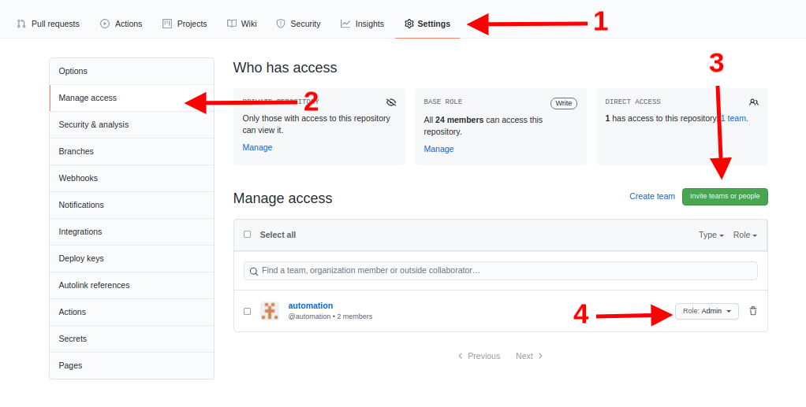
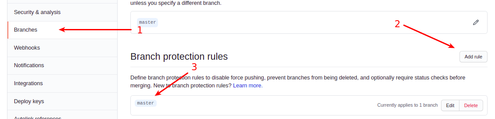
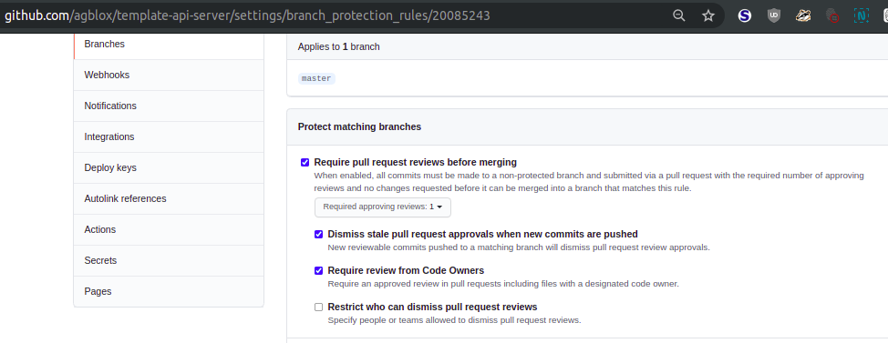
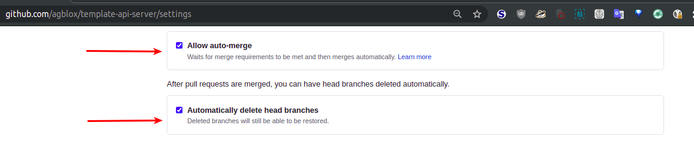
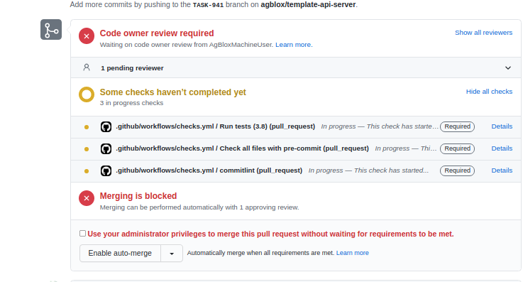

# template-python
![checks][checks] ![release][release]

## Table of contents
* [About](#about)
* [Prerequisites](#prerequisites)
* [Install](#install)
* [Usage](#usage)
* [Build](#build)
* [Deploy](#deploy)
* [Test](#test)
* [Contribute](#contribute)

### About
Base Python repo template.

### Prerequisites
Tools to install: [git][g], [pre-commit][pk], [poetry][p]

You can use [this][a] playbook for automated tools installation(Ubuntu only).

### Install

[Create][1] a new repo from this template.

### Usage
### Repo setup
1. Clone your repo.
1. Add machine user to the [CODEOWNERS](.github/CODEOWNERS)
1. Add your repo to tara.ai workspace. Instruction [here][2].
1. Add `automation` team to the repo admins
   
1. Set branch protection rules for `master` branch

   

   
1. Enable auto-merge and branch deletion after merge
   
1. Find all `replace-me`, `replace_me` or `template-python` strings in repo files or files/dirs names and replace it with actual data.
1. Clean `About`, `Install` and `Usage` sections of this file :) and follow our [requirements][3] to complete setup. If you are not familiar with `poerty` - read this [manual][7]. If you have a questions about secrets check hook - read [this][8] section from our `Secrets` Wiki document.
1. Initialize environment: `make repo-init bootstrap`.

### PR setup
Press `Enable auto-merge`
   

### Build
`release` GitHub [workflow](.github/workflows/release.yml). Release commit types: `fix`, `feat`.

### Deploy

### Test
#### Local
- Test suit: `make tests`
- Type hints: `make test-mypy`

#### CD/CI
`checks` GitHub [workflow](.github/workflows/checks.yml) triggered by PR.

### Contribute
Commit message style - [Conventional Commits][cc].

[g]: https://www.atlassian.com/git/tutorials/install-git
[pk]: https://pre-commit.com/#install
[p]: https://python-poetry.org/docs/#installation
[a]: https://github.com/IaroslavR/ansible-role-server-bootstrap
[cc]: https://www.conventionalcommits.org/en/v1.0.0/

[1]: https://docs.github.com/en/github/creating-cloning-and-archiving-repositories/creating-a-repository-from-a-template
[2]: https://docs.google.com/document/d/128c8Up40PFeZg2LaUkChC3hNv1139-VruFm_SC-ZJiU/edit#heading=h.jutu1mazqqgt
[3]: https://github.com/agblox/DiviAI-Information/wiki/Repos
[7]: https://python-poetry.org/docs/basic-usage
[8]: https://github.com/agblox/DiviAI-Information/wiki/Secrets#pre-commit-hook

[checks]: https://github.com/agblox/template-api-server/actions/workflows/checks.yml/badge.svg
[publish]: https://github.com/agblox/template-api-server/actions/workflows/publish.yml/badge.svg
