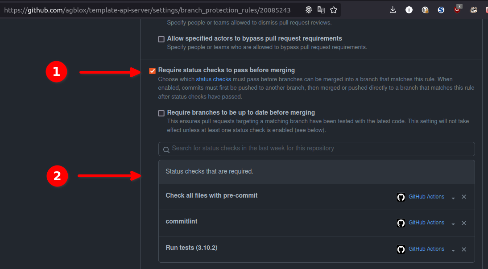

# template-python
![checks][checks] ![release][release]

## Table of contents
* [About](#about)
* [Prerequisites](#prerequisites)
* [Usage](#usage)
  * [Setup local environment](#setup-local-environment)
* [Template usage](#template-usage)
  * [Initial configuration](#initial-configuration)
  * [Files modification](#files-modification)
  * [PR configuration](#pr-configuration)
  * [Additional information](#additional-information)
* [Build](#build)
* [Deploy](#deploy)
* [Test](#test)
* [Contribute](#contribute)

### About
Base Python package/application template.

### Prerequisites
Tools to install: [git][g], [pre-commit][pk], [poetry][p]

You can use [this][a] playbook for automated tools installation(Ubuntu only).

### Usage

Run `make` for list all available targets.

#### Setup local environment

- `git clone git@github.com:agblox/template-python.git`
- `cd template-python`
- `make repo-init bootstrap`

## Template usage

**If you have any questions or problems with this instruction, please contact `@iaro` in our Slack.**

### Initial configuration

1. Create a new repo from this template.

2. Add `automation` team to the repo admins
   
3. Set branch protection rules for `master` branch

   

   
4. Enable auto-merge and branch deletion after merge
   

### Files modification

1. Edit [CODEOWNERS](.github/CODEOWNERS) file.
2. Find all `replace-me`, `template_python` and `template-python` strings in repo files or files/dirs names and replace it with actual data.
3. Open `pyproject.toml` and replace version of your package to the `0.0.1`(line 6).
4. Open `CHANGELOG.md` and delete all after `<!--next-version-placeholder-->` line.
5. Delete `Template usage` sections of this file.
6. :heavy_exclamation_mark: Write all details about your repo in the `About` section.

### PR configuration

Create your first pull request and wait till all checks will be passed. Open repo `Settings` and choice `Branches` tab. Go to the `master` branch protection rules and edit `Require status checks` section.

### Additional information

1. If you are not familiar with `poerty` and other tools - read our [Requirements for Python code](https://github.com/agblox/DiviAI-Information/wiki/Coding-Style) Wiki article.
2. If you have a questions about secrets check hook - read [this](https://github.com/agblox/DiviAI-Information/wiki/Secrets#pre-commit-hook) section from our `Secrets` Wiki article.

## Build

- `release` GitHub [workflow][wr].  Release commit types: `fix` and `feat`.

## Deploy

## Test

### Local

- `make test` for unit tests

### CD/CI

- `checks` GitHub [workflow][wch] triggered by PR.

### Contribute
Commit message style - [Conventional Commits][cc].

[a]: https://github.com/IaroslavR/ansible-role-server-bootstrap
[cc]: https://www.conventionalcommits.org/en/v1.0.0/
[g]: https://www.atlassian.com/git/tutorials/install-git
[p]: https://python-poetry.org/docs/#installation
[pk]: https://pre-commit.com/#install

[wch]: .github/workflows/checks.yml
[wr]: .github/workflows/release.yml

[checks]: https://github.com/agblox/template-python/actions/workflows/checks.yml/badge.svg
[release]: https://github.com/agblox/template-python/actions/workflows/release.yml/badge.svg
